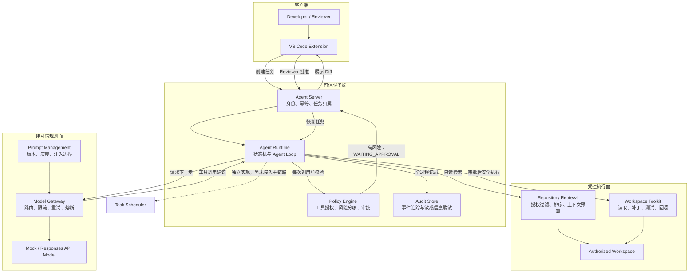
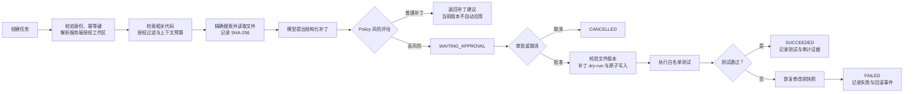

# Bank Coding Agent

面向银行研发场景的安全 Coding Agent 原型。它展示了如何让大模型参与代码分析和补丁规划，同时把文件写入、风险审批、测试执行和审计留在可信的确定性执行层中。

> 这个项目的重点不是“让模型直接改代码”，而是建立一条可授权、可审批、可验证、可回滚、可审计的 Agent 执行链路。

## 项目解决什么问题

开发者可以在 VS Code 中提交自然语言需求，例如：

> 给转账服务增加每日累计限额校验，超过限额返回统一错误码，记录审计日志，并补充单元测试。

系统会在授权工作区内完成以下流程：

1. 收集工作区、当前文件和选区等 IDE 上下文。
2. 检索与需求相关的代码和验收条件。
3. 由模型逐步提出只读工具调用和结构化补丁建议。
4. 由 Runtime 校验工具名称、参数、路径和文件版本。
5. 由 Policy Engine 判断风险，高风险变更进入人工审批。
6. Reviewer 查看 Diff 并批准后，Runtime 才应用补丁。
7. 运行白名单测试；失败时自动恢复修改前的文件。
8. 记录任务、模型、检索、策略、审批、补丁和测试事件。

## 核心设计



系统将模型视为不可信的规划器，而不是执行者：

- 模型可以建议 `retrieve_context`、`search_code`、`read_file` 和 `propose_patch`。
- 模型不能直接调用 `apply_patch`、`run_tests`、Git 推送、合并或部署。
- Runtime 只执行注册过并通过策略校验的工具。
- 高风险补丁只有在 Reviewer 审批后才能写入工作区。

## 端到端执行链路



Runtime 在每个阶段持续产生有序事件和脱敏审计记录；模型不会绕过 Policy Engine
直接进入补丁应用或测试阶段。

## 已实现能力

| 模块 | 当前能力 |
|---|---|
| Agent Runtime | Agent Loop、最大轮次、任务状态、审批暂停、取消、应用补丁、测试与回滚 |
| Model Gateway | Mock 模型、Responses API 适配、数据分级路由、限流、重试、熔断和备用模型 |
| Prompt Management | Prompt 版本、Stable/Canary/Draft、变量校验、灰度分桶和发布 Contract |
| Retrieval | 授权路径过滤、中文银行术语扩展、代码切块、BM25 风格排序和上下文预算 |
| Policy Engine | 工具白名单、交易核心代码风险识别和 Reviewer 审批 |
| Workspace Toolkit | 搜索、读取、SHA-256 版本校验、补丁 dry-run、原子写入、测试白名单和回滚 |
| Audit | Trace 序号、结构化事件和敏感字段递归脱敏 |
| Task Scheduler | 幂等队列、资源租约、心跳、重试、死信、取消和 Snapshot 恢复 |
| Agent Server | HTTP API、SSE 事件回放、任务归属、Reviewer 权限和幂等请求 |
| VS Code Extension | 需求输入、上下文采集、状态展示、Diff 预览、审批和取消 |

## 项目结构

```text
bank-coding-agent/
├── apps/
│   ├── agent-server/           HTTP/SSE API 与任务服务
│   └── vscode-extension/       IDE 入口、Diff 与审批交互
├── packages/
│   ├── agent-runtime/          Agent Loop 与确定性执行流程
│   ├── model-gateway/          模型适配和可靠性治理
│   ├── prompt-management/      Prompt 注册、灰度和发布检查
│   ├── retrieval/              授权代码检索与上下文组装
│   ├── policy-engine/          工具授权和风险审批策略
│   ├── toolkit/                受控工作区工具
│   ├── audit/                  结构化审计与脱敏
│   ├── task-scheduler/         租约式任务队列
│   └── contracts/              跨模块共享协议
├── fixtures/
│   └── bank-transfer-demo/     带验收测试的模拟银行转账项目
├── examples/                   各模块的可运行演示
└── docs/
    └── architecture.md         信任边界、状态机与设计决策
```

详细架构说明见 [`docs/architecture.md`](docs/architecture.md)。

## 快速开始

### 环境要求

- Node.js 22.6 或更高版本
- pnpm 11.9
- VS Code 1.100 或更高版本（仅运行插件时需要）

### 安装依赖

```bash
pnpm install
```

### 运行核心演示

先运行只生成补丁、不修改源码的 Runtime 演示：

```bash
pnpm demo:runtime
```

再运行完整的审批、应用和测试链路：

```bash
pnpm demo:approval
```

审批演示会复制 Fixture 到临时目录中执行，因此不会修改仓库内的示例源码。

其他独立演示：

```bash
pnpm demo:retrieval
pnpm demo:model-gateway
pnpm demo:prompt
pnpm demo:scheduler
pnpm demo:server
```

## 运行 Agent Server

```bash
pnpm --filter @bank-agent/agent-server start
```

默认监听：

```text
http://127.0.0.1:8787
```

默认注册的授权工作区为：

```text
fixtures/bank-transfer-demo
```

当前服务使用演示身份 Header 和内存任务存储，不能直接用于生产环境。

## 运行 VS Code Extension

构建插件：

```bash
pnpm --filter bank-coding-agent-vscode build
```

然后：

1. 用 VS Code 打开项目根目录。
2. 按 `F5` 启动 Extension Development Host。
3. 在新窗口中打开 `fixtures/bank-transfer-demo`。
4. 从命令面板执行 `Bank Agent: 创建编码任务`。
5. 输入“给转账服务增加每日累计限额校验并补充测试”。

默认角色是 `DEVELOPER`，可以查看 Diff 或取消任务。演示审批时，将设置中的 `bankAgent.demoUserRole` 改为 `REVIEWER`。

插件的详细说明见 [`apps/vscode-extension/README.md`](apps/vscode-extension/README.md)。

## 运行测试

```bash
pnpm test:bank
pnpm test:runtime
pnpm test:server
pnpm test:retrieval
pnpm test:model
pnpm test:prompt
pnpm test:scheduler
```

需求验收测试可以单独运行：

```bash
pnpm test:requirement
```

测试覆盖的关键场景包括：

- 工作区路径穿越拦截
- 高风险补丁等待审批
- 非 Reviewer 禁止审批
- 文件版本冲突拒绝写入
- 测试失败自动回滚
- 检索前授权过滤和上下文预算
- 模型重试、熔断、限流和数据分级路由
- Prompt 注入边界、灰度与发布检查
- 队列幂等、租约恢复、重试、死信与取消

## 安全边界

- 用户输入、仓库代码、注释、README、模型输出和工具参数都按不可信数据处理。
- 客户端传入的工作区路径不会直接使用，服务端以 `workspaceId` 解析已注册路径。
- 所有文件工具只能访问授权工作区，拒绝绝对路径和 `../` 路径穿越。
- 文件读取返回 SHA-256；写入前必须匹配补丁中声明的版本。
- 文本替换只有在旧内容恰好出现一次时才能通过 dry-run。
- 测试命令使用固定白名单，并通过 `spawn` 非 Shell 模式执行。
- 高风险修改必须绑定审批记录后才能应用。
- 审计记录会对密码、Token、API Key 和私钥等字段脱敏。
- 主分支推送、合并、部署、任意终端和任意网络访问默认不向模型开放。

## 为什么默认使用 Mock 模型

Mock 模型让工具调用和补丁内容保持确定性，方便先验证 Runtime、Policy、审批、回滚和审计，而不会把平台问题与模型输出的不确定性混在一起。

项目已经包含 Responses API 风格的真实模型适配器以及可靠性网关，但 Agent Server 默认仍使用 `MockBankModel`。真实模型默认测试使用录制响应，不需要 API Key，也不会将 Fixture 代码发送到外部。

## 当前限制

这是一个学习和面试演示原型，以下能力尚未生产化：

- 任务、审批和审计仍主要保存在内存中，服务重启后会丢失。
- Task Scheduler 已独立实现，但尚未接入 Agent Server 主流程。
- SSE 当前用于事件回放，不是持续推送的实时事件流。
- VS Code 插件中的用户身份和角色来自本地演示配置。
- Git 分支与 Revision 尚未通过 VS Code Git API 采集。
- 测试执行尚未迁移到容器或微虚拟机沙箱。
- 检索使用本地关键词排序，尚未接入向量数据库。
- 暂无策略、审批和审计管理控制台。
- 暂不支持自动推送、合并或部署。

## 生产化方向

1. 使用企业 SSO/OIDC 替换演示身份 Header。
2. 使用 PostgreSQL 持久化任务、步骤、审批和审计事件。
3. 将调度器接入 Redis、消息队列或持久化工作流引擎。
4. 将工具执行迁移到网络隔离、资源受限的一次性容器。
5. 引入仓库级 ACL、细粒度 ABAC 和集中策略配置。
6. 实现实时事件流、断线续传和任务恢复。
7. 增加补丁评测集、离线回归和模型/Prompt 发布门禁。
8. 建设 Reviewer、策略、模型和审计管理台。

## 设计原则

1. **模型只提出意图，平台决定是否执行。**
2. **授权过滤发生在检索之前，工具执行前再次检查。**
3. **所有写操作都必须可验证、可审计、可回滚。**
4. **高风险业务修改必须保留人在回路中。**
5. **先用确定性 Fixture 验证平台，再逐步引入真实模型和生产基础设施。**

## License

当前仓库尚未添加开源许可证。在明确许可证之前，代码默认保留全部权利。
