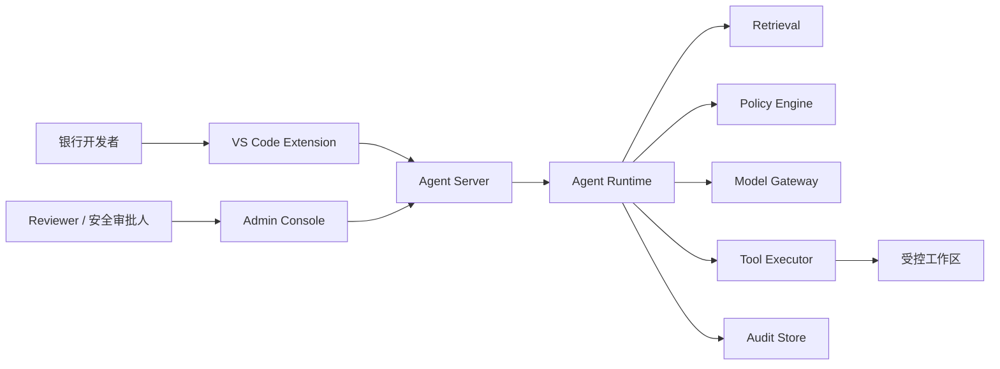
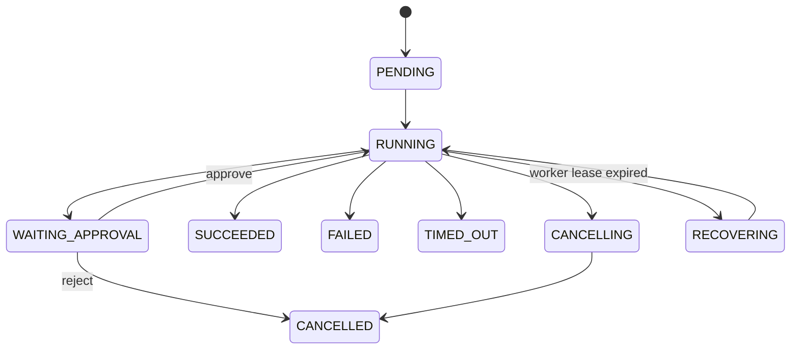

# 架构设计

## 一、系统上下文

## 二、可信边界

### 不可信输入

- 用户自然语言。
- 仓库代码、注释、README、Issue 和终端输出。
- 模型生成内容和工具参数。
- IDE 客户端声明的角色、路径和文件版本。

### 可信执行面

- 服务端验证后的用户身份。
- Policy Engine 的策略决定。
- Runtime 中的 Schema、路径和版本校验。
- 注册工具及其受控执行环境。
- 数据库中的任务状态、审批和审计事件。

## 三、核心对象

### Task

- `taskId`
- `idempotencyKey`
- `userId`
- `workspaceId`
- `baseRevision`
- `status`
- `riskLevel`
- `createdAt`
- `updatedAt`

### Step

- `stepId`
- `taskId`
- `type`
- `inputHash`
- `status`
- `attempt`
- `startedAt`
- `finishedAt`
- `resultRef`

### ToolCall

- `toolCallId`
- `taskId`
- `stepId`
- `toolName`
- `arguments`
- `policyDecision`
- `result`

### Approval

- `approvalId`
- `taskId`
- `reason`
- `requestedBy`
- `decidedBy`
- `decision`
- `diffHash`

### AuditEvent

- `traceId`
- `sequence`
- `actor`
- `action`
- `resource`
- `decision`
- `redactedPayload`
- `timestamp`

## 四、任务状态机

## 五、首个工具集

| 工具 | 默认风险 | 关键校验 |
|---|---|---|
| `search_code` | 低 | 授权仓库、结果数量、敏感文件过滤 |
| `read_file` | 低 | 工作区路径、文件权限、大小上限 |
| `propose_patch` | 中 | Patch Schema、目标文件、原始哈希 |
| `apply_patch` | 中/高 | 审批、文件版本、dry-run、原子应用 |
| `run_tests` | 中 | 命令白名单、超时、目录和环境隔离 |

## 六、第一阶段不做的事情

- 不连接生产代码库。
- 不读取真实银行数据。
- 不允许任意终端命令。
- 不自动推送、合并或部署。
- 不追求多 Agent 协作。
- 不在第一阶段实现真正的向量数据库。

这些限制让项目能够先证明最核心的 Agent Loop、安全边界和工程设计。

